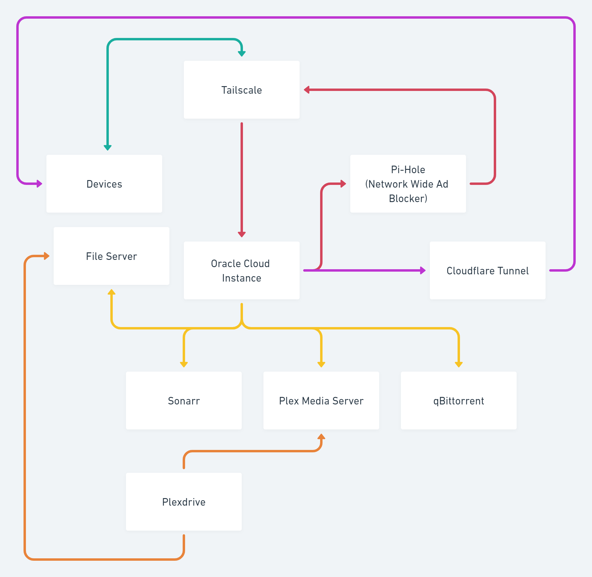

# dotfiles

 

A backup of my personal configuration files made over the years, for different operating systems.

### Packages / Tools

-   [apktool](https://ibotpeaches.github.io/Apktool/): A tool for reverse engineering 3rd party, closed, binary Android apps.
-   [aria2](https://github.com/aria2/aria2): A lightweight multi-protocol & multi-source, cross platform download utility operated in command-line.
-   [cloc](https://github.com/AlDanial/cloc): A tool that counts blank lines, comment lines, and physical lines of code in many programming languages.
-   [dnscontrol](https://github.com/StackExchange/dnscontrol): Synchronize DNS to multiple providers using a simple DSL
-   [fd](https://github.com/sharkdp/fd): A simple, fast and user-friendly alternative to 'find'
-   [lsd](https://github.com/Peltoche/lsd): The next gen ls command
-   [nano](https://www.nano-editor.org/): GNU nano is a small editor for on the terminal.
-   [scrcpy](https://github.com/Genymobile/scrcpy): Display and control your Android device
-   [starship](https://starship.rs/): The minimal, blazing-fast, and infinitely customizable prompt for any shell!
-   [wget](https://www.gnu.org/software/wget/): A free software package for retrieving files using HTTP, HTTPS, FTP and FTPS the most widely-used Internet protocols.

### Current Network Setup

